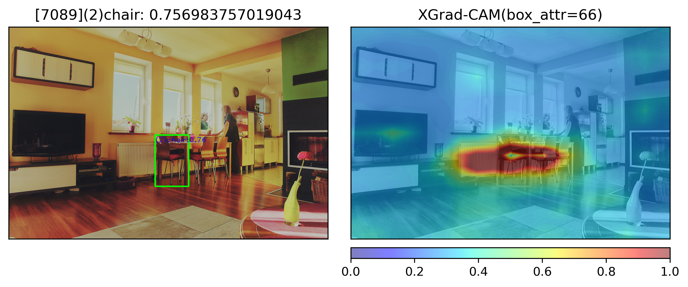
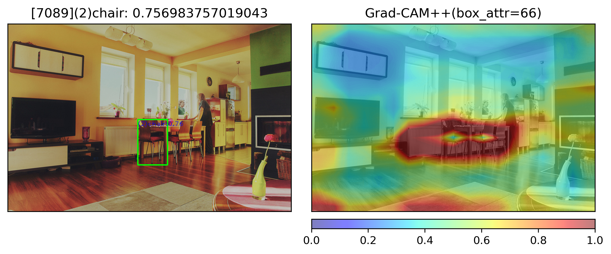

# detex
Explaining object detectors
## Installation
### GPU
```bash
conda env create -n detex -f conda_gpu.yml
conda activate detex
```
### CPU
```bash
conda env create -n detex_cpu -f conda_cpu.yml
conda activate detex_cpu
```

## Download data and annotations
```bash
chmod +x scripts/download_cocoval.sh
./scripts/download_cocoval.sh
```

## Running
### Kernel SHAP
**Example command**: Run Kernel SHAP for the first 100 COCO images, using 2000 samples for approximating SHAP and assign for each perturbed feature a value of 0.5 (light gray), and store results.
```bash
python scripts/kernelshap_ssd.py \
    --first-images=100 \
    --batch-size=16 \
    --shap-samples=2000 \
    --baseline-value=0.5 \
    --result-file="data/results/kshap/kshap_2000s_100i.hdf5"
```

### XGrad-CAM/Grad-CAM++
**Example command**: Run XGrad-CAM for the first 100 COCO images, for thresholding value of 0.5, and store results.
```bash
python scripts/gradcam_ssd.py \
    --first-images=100 \
    --explainer-engine="XGrad-CAM" \
    --baseline-value=0.5 \
    --result-file="data/results/cam/xgradcam_100i.hdf5"
```
**Example command**: Run Grad-CAM++ for the first 100 COCO images, for thresholding value of 0.5, and store results.
```bash
python scripts/gradcam_ssd.py \
    --first-images=100 \
    --explainer-engine="Grad-CAM++" \
    --baseline-value=0.5 \
    --result-file="data/results/cam/gradcampp_100i.hdf5"
```
## Results
### Kernel SHAP
- Kernel SHAP trains a linear explanation model to locally approximate the true model (using LIME framework)
- Exact runtime grows exponentially with the number of features, i.e. pixels.
- To constraint the runtime, we
  -  segment image into 256 SLIC superpixels, each corresponding to one feature
  -  train a surrogate model on 2000 samples (perturbations) per explanation (detected box)
- Evaluated on the first 100 images of COCO 2017 using SSD detector


#### Examples:
Correct detection

Incorrect detection


#### Pixel flipping
 - Area Under the Curve (trapezoidal rule): ~ 7.023 (unnormalized), or 0.0236 (normalized against 254 boxes) 


#### Localization metrics
 - Positive attribution inside box (against all positive attribution): 23.6%
 - Box coverage:  64.8%
 - IoU: 20.9%

#### Runtime
 - On Google Colab's Tesla P100
 - Batch size = 128
 - 100 images (254 boxes): 2 hours 6 minutes
 - Average time per explanation (i.e. box): ~30 seconds


### XGrad-CAM/Grad-CAM++
- Implement two Class Activation Mapping (CAM) methods: XGrad-CAM and Grad-CAM++
- These two methods are the generalized version of Grad-CAM
- Grad-CAM is a model-specific local XAI method that extracts interested CAM visualization by weighting the feature map at one particular convolutional layer with its gradient caused by backpropagating a target prediction
- Runtime grows exponentially with the model complexity and linearly with the number of pixels

#### Examples:
- XGrad-CAM
Correct detection

Incorrect detection

- Grad-CAM++
Correct detection

Incorrect detection

#### Pixel flipping
 - XGrad-CAM: Area Under the Curve (trapezoidal rule): ~ 9.457 (unnormalized), or 0.0372 (normalized against 254 boxes) 

 - Grad-CAM++: Area Under the Curve (trapezoidal rule): ~ 13.024 (unnormalized), or 0.0512 (normalized against 254 boxes) 

#### Localization metrics
XGrad-CAM:
 - Positive attribution inside box (against all positive attribution): 18.65%
 - Box coverage:  64.74%
 - IoU: 16.93%
Grad-CAM++:
 - Positive attribution inside box (against all positive attribution): 14.59%
 - Box coverage:  72.96%
 - IoU: 13.84%
#### Runtime
 - On Intel(R) Core(TM) i5-7360U CPU @ 2.30GHz
 - 100 images (254 boxes): 38 minutes
 - Average time per explanation (i.e. box): ~9 seconds

## Pixel flipping comparisons

- All three methods yield on point explanations for detected objects
- kSHAP is slightly better than the two Grad-CAM methods
- Among Grad-CAM methods, XGrad-CAM is slightly better than Grad-CAM++
